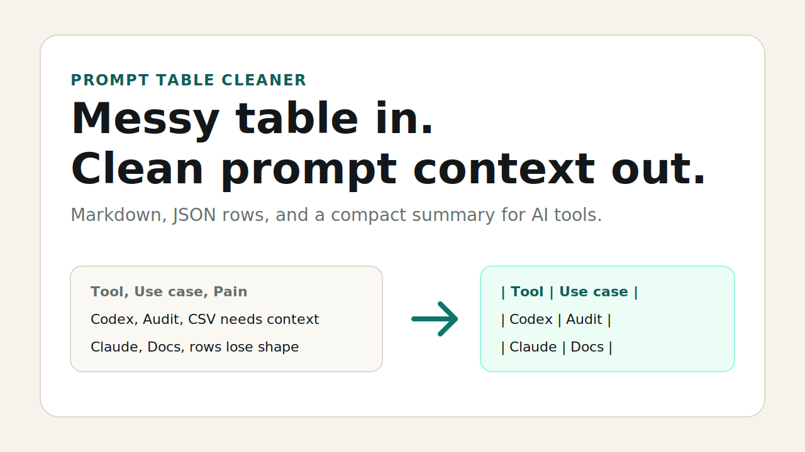

# Prompt Table Cleaner

Paste messy table text. Get clean Markdown and JSON for AI prompts.



Prompt Table Cleaner is a static browser demo for people who copy tables from dashboards, docs, search results, CSV exports, or admin screens before pasting them into ChatGPT, Codex, Claude, or another agent.

## Try It

- Local demo: open `demo/index.html`
- GitHub Pages-ready demo: `docs/index.html`
- Sample input: `data/sample-table.csv`

Expected Pages URL after enabling GitHub Pages from `main /docs`:

`https://yitengruntu.github.io/prompt-table-cleaner/`

## What It Produces

- Markdown table
- JSON rows
- compact prompt summary

## The Demand Test

This repo is a 72-hour interest probe, not a finished product.

Open an issue if you want a real workflow:

- Chrome extension
- clipboard tool
- CLI command
- live HTML table extraction
- Codex or agent integration

Those requests decide whether this becomes a real utility.

## Run The Check

```bash
npm run validate
```
